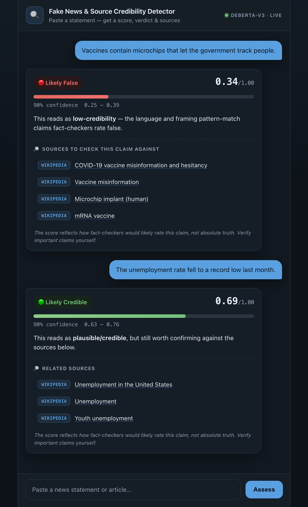

# Fake News & Source Credibility Detector

[](https://github.com/Sanjana132/FakeNewsCredibilityAssesor/actions/workflows/ci.yml)


An end-to-end ML system that assigns any statement a **continuous credibility
score in [0, 1]** — not a binary real/fake label — together with a **calibrated
confidence interval**, a **token-level explanation** of what drove the verdict,
**retrieval of contradicting sources**, and an **LLM-generated justification**.

> Regression, not classification: "0.18 ± 0.06 — Likely False" is more honest and
> more useful than a hard "FAKE", and it lets the system express uncertainty.

## Demo

Paste a statement into the chatbot and it returns a credibility score, a verdict
with a 90% confidence interval, and sources to check the claim against — the
disputing ones surfaced first for low-credibility claims.

<p align="center">
  
</p>

<p align="center"><sub>Actual model outputs from the Gradio chatbot.</sub></p>

---

## Highlights

- **~92k claims** merged and normalised from **4 public fact-checking datasets**
  (LIAR-2, MultiFC, FEVER, AVeriTeC) onto one 0–1 credibility scale.
- **Two-model stack**: a transparent **TF-IDF + Ridge** baseline (the MAE floor)
  and a fine-tuned **DeBERTa-v3** regressor with a fusion head over 13 engineered
  features.
- **Measured uncertainty**: **MC-Dropout** confidence intervals plus a
  **calibration** pass (reliability diagram, Expected Calibration Error,
  temperature scaling).
- **Explainability**: token-level **SHAP** highlights (green = credibility-raising,
  red = credibility-lowering).
- **Agentic RAG**: a **LangGraph** pipeline that retrieves evidence from the Google
  Fact Check API, Wikipedia, a local FAISS index, and NewsAPI, then has a
  **Mistral-7B (QLoRA)** model write an evidence-grounded justification.
- **Production-minded**: hardened **FastAPI** service (API-key auth, rate limiting,
  Redis cache, SSE streaming), **Docker Compose** stack, **80 unit tests**, and
  **GitHub Actions CI**.
- **Reproducible**: global seeding, train-only data-driven priors (no leakage),
  and a one-click **Google Colab GPU** training notebook.

---

## Results

Measured on the held-out test split (~8.9k claims). The fine-tuned DeBERTa-v3
regressor cuts test MAE **~13%** below the TF-IDF baseline.

| Model | Test MAE ↓ | Test Macro-F1 (3-class) ↑ |
|-------|-----------:|--------------------------:|
| TF-IDF + Ridge baseline (+ 13 features) | 0.2877 | 0.493 |
| **DeBERTa-v3-base (fusion head + MC-Dropout)** | **0.2512** | **0.555** |

Per-dataset test MAE (DeBERTa) — the gain is broad-based, strongest on the hard
political-claims slice, not carried by one easy corpus:

| Slice | LIAR-2 | MultiFC | AVeriTeC | FEVER |
|-------|-------:|--------:|---------:|------:|
| Test MAE ↓ | **0.203** | 0.234 | 0.266 | 0.281 |

<sub>3-class buckets: false (<0.35), mixed (0.35–0.65), true (≥0.65). Best epoch 4,
validation MAE 0.2553. Metrics are written to `models/deberta_results.json`.</sub>

### Calibration & uncertainty

| Metric | Value | Target | Status |
|--------|------:|-------:|:------:|
| Expected Calibration Error (10-bin) | **0.042** | < 0.05 | ✅ pass |
| ECE after temperature scaling (T=1.08) | 0.040 | < 0.05 | ✅ |
| MC-Dropout 90% CI coverage | 0.196 | ≈ 0.90 | ❌ fail |

The **point estimates are well-calibrated** (ECE 0.042 over 8,950 test claims).
The **MC-Dropout confidence intervals are over-confident** — 90% coverage is only
0.196, i.e. the intervals are too narrow, a known limitation of MC-Dropout.
Conformal calibration (MAPIE) to fix coverage is on the roadmap; the point score
and its calibration are the trustworthy signal today. Numbers are written to
`models/calibration.json`.

---

## Architecture

```
                 ┌─────────────────────────────────────────────┐
  raw claim ───► │ Data pipeline   clean · normalise context    │
  + speaker      │ (22 venues) · 13 engineered features         │
  + context      │ (VADER + opinion lexicon +                   │
                 │  context×sentiment interactions)             │
                 └───────────────┬─────────────────────────────┘
                                 ▼
        ┌────────────────────────┴───────────────────────┐
        ▼                                                 ▼
 ┌───────────────┐                            ┌──────────────────────────┐
 │ TF-IDF+Ridge  │  baseline MAE floor        │ DeBERTa-v3 encoder        │
 │ baseline      │                            │ mean-pool → LayerNorm     │
 └───────────────┘                            │ ⊕ standardised features   │
                                              │ → fusion head → score     │
                                              │ + MC-Dropout 90% CI       │
                                              └────────────┬─────────────┘
                                                           ▼
              calibration (ECE, reliability, temperature scaling)
                                                           ▼
   if score < 0.5 ──► LangGraph retrieval agent: gather evidence
        (Google Fact Check · Wikipedia · FAISS · NewsAPI) ──► Mistral-7B
        (QLoRA) writes a grounded justification
                                                           ▼
        FastAPI service · Gradio chatbot · Docker Compose stack
```

---

## Datasets

| Source | Rows | What it adds |
|--------|-----:|--------------|
| [LIAR-2](https://huggingface.co/datasets/chengxuphd/liar2) | ~22.9k | PolitiFact political claims, 6-way labels, speaker credit history, justifications |
| [FEVER](https://huggingface.co/datasets/lucadiliello/fever) | ~47.8k (capped) | Wikipedia factual claims (supports/refutes/NEI) |
| [MultiFC](https://huggingface.co/datasets/pszemraj/multi_fc) | ~17.6k | 26 fact-checkers, health/science/social-media domains |
| [AVeriTeC](https://huggingface.co/datasets/pminervini/averitec) | ~3.5k | Web-verified claims with Q&A evidence chains |

All labels are mapped to a single **0.0–1.0** credibility scale, deduplicated,
and split 80/10/10 with **joint stratification** on credibility bucket × dataset.
Context priors are computed with **Bayesian shrinkage from the training split only**
— validation/test labels never leak into features.

---

## Repository layout

| Component | Module(s) | Purpose |
|-----------|-----------|---------|
| Data pipeline | `data_pipeline.py` | Load/merge datasets, normalise context, engineer 13 features, EDA |
| Baseline | `baseline_model.py` | TF-IDF + Ridge regressor + SHAP (the MAE benchmark) |
| Credibility model | `deberta_model.py` | DeBERTa-v3 fine-tuning, fusion head, MC-Dropout intervals |
| Calibration | `calibration.py` | Reliability diagram, ECE, temperature scaling |
| Source profiles | `context_encoder.py`, `speaker_profiler.py` | Learned context embeddings, Bayesian speaker credibility |
| Explainability | `shap_explainer.py` | Token-level SHAP attributions |
| Justification LLM | `llm_finetune.py` | Mistral-7B QLoRA evidence-grounded justifications |
| Retrieval agent | `agent/` | LangGraph pipeline + 4 evidence-retrieval tools |
| Serving API | `api/` | Hardened FastAPI service (auth, rate limiting, Redis cache, SSE) |
| Chatbot demo | `gradio_app.py` | Conversational UI (score + verdict + sources) |
| Evidence scraper | `speaker_scraper.py` | PolitiFact/Snopes metadata → FAISS index |
| Infrastructure | `Dockerfile.*`, `docker-compose.yml` | Containerised API / LLM / demo stack |
| Core | `config.py`, `utils/`, `tests/`, `.github/` | Config, seeding, 80 tests, CI |

---

## Usage

**Install and build the dataset**

```bash
git clone https://github.com/Sanjana132/FakeNewsCredibilityAssesor.git
cd FakeNewsCredibilityAssesor
pip install -r requirements.api.txt
python -m nltk.downloader stopwords punkt punkt_tab opinion_lexicon
python data_pipeline.py        # load 4 datasets, engineer features, run EDA
python baseline_model.py       # TF-IDF + Ridge baseline
```

**Train the credibility model** (GPU) — the `colab_train_from_git.ipynb` notebook
runs the full pipeline on a free Colab T4:

```bash
python deberta_model.py --train --device cuda --amp
python calibration.py --device cuda
```

**Serve**

```bash
uvicorn api.main:app --port 8000     # REST API → /docs
python gradio_app.py                 # chatbot demo → localhost:7860
docker compose up redis api admin    # or the full containerised stack
```

Optional retrieval keys enrich the agent's sources: `GOOGLE_FACTCHECK_API_KEY`
(fact-check verdicts, free) and `NEWSAPI_KEY`. Wikipedia retrieval needs no key.

---

## Testing & CI

```bash
pip install -r requirements.dev.txt
pytest tests/
```

The **80 tests** cover context normalisation, every dataset's label map, feature
arithmetic, the Bayesian-prior shrinkage (including the **train-only / no-leakage
invariant**), and a 200-row end-to-end pipeline smoke test. GitHub Actions runs
them on every push against a minimal dependency set.

---

## Engineering practices

- **No data leakage** — context priors are fit on the train split only; a unit
  test asserts they are identical whether or not validation/test rows exist.
- **Reproducibility** — `set_seed(42)` seeds Python/NumPy/PyTorch/langdetect at
  every entrypoint; dataset sampling shuffles before selecting, never first-N.
- **Measured uncertainty** — calibration is reported both ways: ECE 0.042 (point
  scores well-calibrated) and the failing MC-Dropout CI coverage (0.196). Nothing
  is claimed without the numbers behind it.
- **Feature/serving parity** — the API computes inference features via the exact
  training function, so production scores match evaluation.

## Limitations & roadmap

- Labels come from fact-checkers and inherit their topical and temporal biases;
  the score reflects "how fact-checkers would rate this", not absolute ground truth.
- **MC-Dropout intervals are over-confident** (90% CI coverage 0.196) — the
  calibrated point score is the reliable signal until conformal calibration lands.
- The Mistral justification layer and FAISS evidence index are optional and require
  a GPU and a scraped index respectively.
- **Roadmap:** conformal prediction intervals (MAPIE) to fix CI coverage,
  continuous learning from user feedback, drift monitoring, and cloud deployment.

---

## License

MIT — see `LICENSE`.

*An end-to-end ML engineering project: data pipeline → classical baseline →
transformer fine-tuning → calibration → LLM + RAG agent → API → containerisation
→ tests / CI.*
